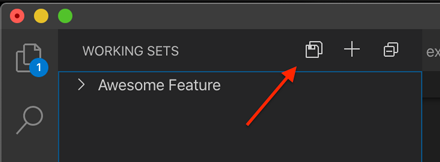
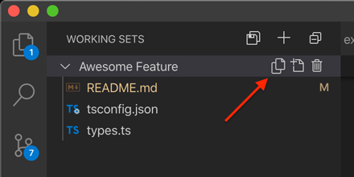

  

# Visual Studio Code Working Sets

Conveniently manage "working sets" of files. This extension allows you to create, delete, add/remove files to, and switch between working sets with ease.

## Features

### Available Commands in Command Palette

- `Working Sets: Create`
- `Working Sets: Delete`
- `Working Sets: Add Active Editor to Working Set`
- `Working Sets: Open All Files in Working Set`
- `Working Sets: Remove File from Working Set`
- `Working Sets: Add All Open Editors to Working Set`
- `Working Sets: Sort Working Sets in Ascending Order`
- `Working Sets: Sort Working Sets in Descending Order`
- `Working Sets: Sort Files in Ascending Order`
- `Working Sets: Sort Files in Descending Order`

### Create a Working Set

Create an empty Working Set from the Working Sets sidebar view.

You can also use the `Working Sets: Create` command.

### Add Files to a Working Sets

Add all open editors to a Working Set.

> NOTE: This feature is a little hack I learned from [another great extension](https://marketplace.visualstudio.com/items?itemName=eamodio.restore-editors). VS Code does not expose (yet) an API to access the open editors, so we need to cycle through them to add them all into a Working Set. The VS Code team is working on adding this API and I will update this extension once they do.

You can also use the `Working Sets: Add All Open Editors to Working Set` command.

---

Add the active editor to a Working Set.

You can also use the `Working Sets: Add Active Editor to Working Set` command.

---

Add a file from the Explorer context menu.

### Open an Existing Working Set

Open all the editors in a Working Set from the Working Sets sidebar view.

You can also use the `Working Sets: Open All Files in Working Set` commmand.

### Remove a File from a Working Set

Remove a file from a Working Set from the Working Sets sidebar view.

You can also use the `Working Sets: Remove File from Working Set` command.

### Delete a Working Set

Delete a Working Set from the Working Sets sidebar view.

You can also use the `Working Sets: Delete` command.

### Sort Working Sets

Sort Working Sets (Ascending or Descending) from `...` menu in Working Sets sidebar view title.

You can also use the following commands:

- `Working Sets: Sort Working Sets in Ascending Order`
- `Working Sets: Sort Working Sets in Descending Order`

### Sort Files within a Working Sets

Sort files in a Working Sets (Ascending or Descending)

You can also use the following commands:

- `Working Sets: Sort Files in Ascending Order`
- `Working Sets: Sort Files in Descending Order`

### Move Files Manually within a Working Sets

Move files in a Working Sets (Up or Down)

## Extension Settings

| Key                             | Default | Description                                         |
| ------------------------------- | ------- | --------------------------------------------------- |
| `workingSets.confirmOnDelete`   | `true`  | Show confirmation popup when deleting a Working Set |
| `workingSets.showNotifications` | `false` | Show confirmation notifications after every action  |

## Known Issues

- Cycling through all the open editors when saving to a Working Set will be fixed once the VS Code team provides an API for accessing the open editors.
